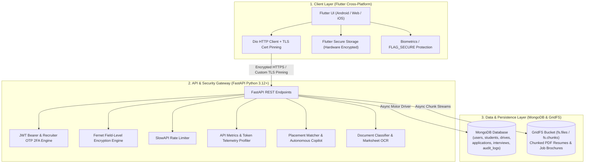

# TalentLOQ — System Overview, Architecture & Project Goals

> **Connecting Students to Opportunity**  
> An enterprise-grade campus recruitment and placement tracking ecosystem for students, university placement cells, and corporate recruiters.

---

## 1. Executive Summary & Project Goal

### 1.1 What is TalentLOQ?
**TalentLOQ** is an end-to-end, multi-role campus recruitment platform designed to automate and digitize the complete lifecycle of university hiring drives. Developed for institutions like **GSFC University**, it unifies students, recruiters, and placement officers into a single, cohesive, and secure digital environment.

### 1.2 Core Problem Statement
Traditional university campus hiring suffers from significant operational friction:
* **Manual & Error-Prone Processes**: Relying on unorganized spreadsheets, paper-based forms, and shared drives causes data desynchronization and missed records.
* **Fragmented Communication Channels**: Circulars, notices, and interview schedules sent via scattered WhatsApp groups or emails lead to missed student interviews.
* **Lack of Real-Time Tracking**: Students often remain unaware of where they stand across multi-round interview pipelines (Aptitude, Technical, HR).
* **Administrative Overhead for Recruiters**: Placement coordinators and corporate HRs spend extensive hours manually filtering candidate criteria (CGPA, active backlogs, eligible degree branches) and validating resume authenticity.
* **Data Security & Privacy Risks**: Sensitive student academic records, identity details, and contact numbers are frequently exposed without field encryption or access controls.

### 1.3 Key Project Objectives
1. **Automate Eligibility & Application Submission**: Real-time programmatic filtering based on minimum CGPA cutoffs, maximum allowed backlogs, school/branch tags, and application deadlines.
2. **AI-Driven Placement Intelligence**: Provide role-adaptive candidate match scoring, skill gap identification, and automated technical interview question generation for recruiters.
3. **Structured Live Selection Pipeline**: Deliver transparent, round-by-round status tracking (Applied $\rightarrow$ Aptitude $\rightarrow$ Technical $\rightarrow$ HR $\rightarrow$ Offer Dispatch) with direct recruiter-to-student messaging.
4. **Document Verification & Anti-Fraud Screening**: Automatically classify uploaded PDF documents, extract academic grades/marksheet data, and reject non-resume submissions (e.g. assignments, bills, question papers).
5. **Bank-Grade Data Security**: Enforce field-level encryption (Fernet AES-128-CBC + HMAC-SHA256) at rest, TLS certificate pinning in transit, dual-token JWT authentication with silent refresh, 2-step OTP verification, and device fingerprinting.

---

## 2. High-Level System Architecture

TalentLOQ is built on a decoupled, production-ready **3-Tier Architecture**:



---

## 3. Technology Stack

| Layer | Technologies & Libraries | Functionality |
| :--- | :--- | :--- |
| **Frontend Framework** | **Flutter (Dart `^3.12.2`)** | Cross-platform client for Android, iOS, and Web |
| **UI Design System** | **Material 3 / Custom AppColors** | Theme-aware light & dark modes, floating navigation dock |
| **Networking & Pinning** | **Dio (`^5.4.1`)** | REST requests, custom TLS SHA-256 certificate pinning |
| **Mobile Security** | **`flutter_secure_storage`, `local_auth`** | Encrypted keystore/keychain storage, biometric unlocking |
| **Document Viewing** | **`file_picker`, `open_filex`** | Native PDF picking and sandboxed system document viewer |
| **Backend Framework** | **Python 3.12+ / FastAPI** | Asynchronous ASGI REST server (`app/main.py`) |
| **Validation & Schema** | **Pydantic v2** | Strict schema validation, sanitization, serialization |
| **Database Engine** | **MongoDB (Motor & PyMongo)** | High-throughput asynchronous NoSQL document storage |
| **Binary File Storage** | **MongoDB GridFS** | Resilient chunked storage for PDF resumes and attachments |
| **Authentication** | **PyJWT & Passlib (Bcrypt)** | Cryptographic HS256 tokens, salt-hashed credentials |
| **Field Encryption** | **Cryptography (Fernet)** | AES-128-CBC + HMAC-SHA256 encryption for sensitive PII |
| **Rate Limiting** | **SlowAPI** | Protection against brute-force attacks on auth routes |
| **AI Inference & LLM** | **Groq, Mistral, Gemini, OpenRouter** | Multi-provider fallback cascade with live token telemetry |
| **Document Processing** | **PyPDF, pdfplumber, FastEmbed** | Vector semantic search, regex extraction, marksheet tables |
| **Containerization** | **Docker & Docker Compose** | Multi-stage production container builds |
| **Orchestration** | **Kubernetes (K8s)** | Production manifests with Kustomize, PVC, and Ingress |

---

## 4. Core Modules & How They Work

### 4.1 Authentication & Role-Based Access Control (RBAC)
- **Domain-Restricted Student Registration**: Registration requires university-verified email domains (e.g. `@gsfcuniversity.ac.in`). Academic credentials (CGPA, active backlogs, degree) are registered at creation.
- **Recruiter 2-Step OTP Authentication**: Recruiter logins require whitelisted email addresses. Successful password verification issues a 5-minute temporary token and generates a 6-digit cryptographic OTP sent via email.
- **Dual-Token Lifetime Management**:
  - **Access Token**: Short-lived (15 minutes) for low attack exposure.
  - **Refresh Token**: Long-lived (7 days) stored in encrypted device hardware.
  - **Silent Token Negotiation**: `ApiClient` automatically detects 401 Unauthorized responses and fetches a new access token without interrupting user interaction.

### 4.2 Placement Drives Lifecycle
- **Drive States**: `Draft` $\rightarrow$ `Published` $\rightarrow$ `Completed` $\rightarrow$ `Closed`.
- **Granular Configurations**: Company metadata, role title, package CTC range (Min - Max LPA), bond duration, job description attachments, interview rounds breakdown, minimum CGPA cutoff, and registration deadline.
- **Eligibility Engine**: Student profiles are dynamically evaluated against company criteria in real time. If a student has backlogs exceeding the limit or a CGPA below cutoff, application submission is blocked with an explanatory error.

### 4.3 Candidate Validation Dashboard
- **Recruiter Screening Console**: Centralized verification board where recruiters review applicants across published drives.
- **Multi-State Filters**: Filter applicants by status (`All`, `Pending`, `Valid`, `Not Valid`).
- **One-Tap Validation**: Quick toggling between valid and invalid statuses to approve candidates for round progression.
- **AI Match Insights**: Displays calculated candidate match scores and synthesized interview cheat sheets.

### 4.4 Scheduled Campus Interviews Hub
- **Slot Scheduling**: Recruiters select candidate, date horizon, time slots (Morning, Afternoon, Evening), and interview type (Aptitude, Technical Round, HR Screen, Executive Assessment).
- **Result & Round Progression**: Recruiters log candidate round evaluations (`Pass`, `Fail`, `On Hold`), attach custom interview feedback notes, and advance candidates to subsequent rounds.
- **Offer Setup & Dispatch**: Configuration of joining dates, CTC breakdown, and dispatch of formal selection offer letters directly to the student dashboard.

### 4.5 Direct Messaging & Real-Time Notifications
- In-app 1-on-1 recruiter-student chat (`/chat/conversations`, `/chat/messages`).
- Automated push and in-app alerts on drive publication, application updates, interview bookings, and final selections.

---

## 5. AI Placement Intelligence & Document Engine

```
[ Uploaded PDF File ]
         │
         ├───► [ 1. Document Classifier ] ──────► Rejects Non-Resumes (Bills/Homework/Papers)
         │
         ├───► [ 2. Marksheet OCR Engine ] ─────► Extracts SGPA/CGPA & Verifies Authenticity
         │
         └───► [ 3. Placement Match Agent ] ────► Multi-Rubric Fit Score & Interview Questions
```

### 5.1 Document Classification & Anti-Fraud Filtering
Located in `backend/app/document_detection/classifier.py`:
- **Section Scoring Matrix**: Computes confidence scores based on resume anchors: `EDUCATION`, `WORK EXPERIENCE`, `PROJECTS`, `SKILLS`, `CERTIFICATIONS`.
- **Anti-Fraud Disqualifiers**: Rejects non-resume submissions such as:
  - Invoices and billing receipts (detects tax rates, invoice numbers, amounts).
  - Academic assignments and examination question papers.
  - Research papers and IEEE publications.
  - Standalone participation certificates lacking resume structures.

### 5.2 Marksheet & Academic Extractor
Located in `backend/app/document_detection/marks_table_extractor.py`:
- Extracts tabular semester marks, credit points, and SGPA/CGPA from 10th, 12th, Diploma, and Undergraduate marksheets to prevent manual grade exaggeration.

### 5.3 Placement Matching Agent & Token Telemetry
Located in `backend/app/services/groq_matcher.py`:
- Evaluates candidate fit across four role-adaptive dimensions:
  1. **Core Technical Skills (30–50%)**: Primary required skill match and depth.
  2. **Project Depth (20–40%)**: Real-world application complexity and architecture.
  3. **Role Readiness (10–25%)**: Tooling familiarity (Git, Docker, CI/CD, tests).
  4. **Learnability & Skill Gap (10–20%)**: Adjacency of candidate skills to missing requirements.
- **Terminal Token Telemetry**: Automatically measures and logs exact prompt tokens, completion tokens, total tokens, and query latency on every inference run.

### 5.4 Multi-Provider LLM Fallback Cascade
Located in `backend/app/services/llm_service.py`:
- Resilient zero-downtime AI inference with automatic fallback:
  - **Tier 1 (Primary)**: Mistral AI (`mistral-small-latest`).
  - **Tier 2 (High-Speed)**: Groq LPU (`qwen/qwen3.8-27b`).
  - **Tier 3 (Aggregator)**: OpenRouter.
  - **Tier 4 (High-Context)**: Google Gemini (`gemini-flash-latest`).

---

## 6. Comprehensive Security & Compliance Architecture

```mermaid
graph TD
    Client["Flutter Mobile / Web"] -->|HTTPS + SHA-256 Fingerprint Pinning| Gateway["FastAPI Server"]
    Gateway -->|HS256 Signature Verification| AuthEngine["PyJWT Authenticator"]
    Gateway -->|Role Check| RBAC["Role Based Access Control (Exact Match)"]
    Gateway -->|AES Fernet Decryption| PII["Field-Level Sensitive PII"]
    Gateway -->|Depends(get_current_user)| FileServer["Protected GridFS / Files"]

    subgraph Device Security
        Client --> FLAG_SECURE["Android FLAG_SECURE (Anti-Screenshot)"]
        Client --> BIOMETRICS["Biometric Auth (Fingerprint / Face ID)"]
        Client --> SECURE_STORAGE["Encrypted SharedPreferences / Keychain"]
    end
```

1. **Field-Level Data Encryption (Fernet)**: Sensitive student PII (CGPA, backlogs, contact details) is encrypted at rest in MongoDB using AES-128-CBC authenticated with HMAC-SHA256 (`backend/app/encryption.py`).
2. **TLS Certificate Pinning**: `CertPinningConfig` in Flutter verifies SHA-256 fingerprints of server X509 certificates to neutralize Man-in-the-Middle (MitM) proxy attacks.
3. **Hardware-Backed Secret Storage**: Tokens and device identifiers are stored using `FlutterSecureStorage` (Android Keystore / iOS Keychain).
4. **Android `FLAG_SECURE`**: Prevents screen capturing, screenshots, and task switcher previews on sensitive recruiter views.
5. **Rate Limiting & Threat Shielding**: `slowapi` limits authentication and sensitive endpoints to mitigate credential stuffing and brute-force attempts.
6. **Windows Event Loop Safeguard**: Automated teardown protection for Python 3.12 `WindowsProactorEventLoopPolicy` preventing `_ssock` crashes during developer hot-reload.

---

## 7. Database Architecture & Collections

MongoDB stores data across indexed collections with automated TTL expiration:

* **`users`**: Core user accounts, bcrypt password hash, role (`student` / `recruiter`), lockout timestamps, and trusted devices.
* **`students`**: Academic profile, verified education, encrypted CGPA, backlogs, skills, career preferences, and resume file ID.
* **`drives`**: Company hiring drives, job descriptions, CTC packages, eligibility cutoffs, and schedules.
* **`company_listings`**: Verified company partner profiles, locations, and hiring histories.
* **`applications`**: Compound-indexed records linking students to drives, tracking round progression, and interview outcomes.
* **`interviews`**: Scheduled interview slots, interview types, candidate IDs, and recruiter notes.
* **`conversations` & `messages`**: Messaging threads, chronological text messages, timestamps, and read receipts.
* **`audit_logs`**: System audit records capturing logins, status changes, IP addresses, and device signatures.
* **`refresh_tokens` & `otps`**: Temporary tokens and 6-digit codes with automatic MongoDB TTL expiration.
* **`fs.files` & `fs.chunks`**: MongoDB GridFS bucket for binary storage of PDF resumes and brochures.

---

## 8. Directory Structure

```text
TalentLOQ/
├── backend/
│   ├── app/
│   │   ├── document_detection/    # Structural document classifier & marksheet OCR
│   │   ├── routers/               # FastAPI route controllers (auth, drives, recruiter, chat, etc.)
│   │   ├── services/              # AI Matcher, LLM fallback cascade, Autonomous agent
│   │   ├── config.py              # Pydantic environment settings
│   │   ├── database.py            # Motor async & PyMongo database connections
│   │   ├── dependencies.py        # RBAC and authentication dependencies
│   │   ├── encryption.py          # Fernet field-level encryption
│   │   ├── jwt_utils.py           # JWT generation and validation
│   │   ├── main.py                # FastAPI entrypoint, middleware, and lifecycle handlers
│   │   ├── middleware.py          # Security headers & API latency profiler
│   │   └── models.py              # Pydantic data schemas
│   ├── tests/                     # 170+ automated unit & integration test cases
│   ├── Dockerfile                 # Multi-stage production backend container image
│   └── requirements.txt           # Python backend dependencies
├── lib/
│   ├── models/                    # Dart data models (Job, Candidate, Application, etc.)
│   ├── navigation/                # MainNavigationWrapper & role-based bottom dock
│   ├── network/                   # Dio ApiClient & CertPinningConfig
│   ├── screens/                   # UI feature screens (auth, dashboard, jobs, recruiter, chat, profile)
│   ├── services/                  # Frontend services (AuthService, RecruiterService, DriveService)
│   ├── theme/                     # AppColors & Material 3 theme configuration
│   └── main.dart                  # Flutter entry point
├── k8s/                           # Production Kubernetes manifests (StatefulSet, Ingress, Kustomize)
├── docker-compose.yml             # Local multi-container Docker deployment
├── Dockerfile.frontend            # Nginx production container for Flutter Web
├── pubspec.yaml                   # Flutter dependencies and assets
├── PROJECT_CONTEXT.md             # Developer context & schema notes
└── README.md                      # Quickstart and repository guide
```

---

## 9. Verification & Quality Assurance

* **Automated Backend Testing**: Comprehensive Pytest suite covering authentication, RBAC, document verification, encryption, and recruiter workflows (**170 tests passing**).
* **Static Analysis**: Clean `flutter analyze` with 0 issues.
* **Production Containerization**: Multi-stage Docker builds for backend and frontend with Docker Compose and Kubernetes orchestration ready for deployment.
