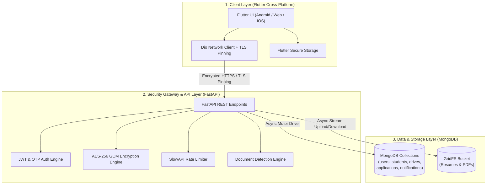

# TalentLOQ — Campus Placement & Recruitment Tracking Platform

> **Connecting Students to Opportunity** | A Next-Generation Campus Recruitment Ecosystem for Students, Corporate Recruiters, and University Placement Cells.

---

## 1. Overview

**TalentLOQ** is an enterprise-grade, cross-platform placement tracking platform engineered to automate and digitize the end-to-end campus recruitment lifecycle. Built to replace error-prone manual spreadsheets, physical paperwork, and fragmented communication channels, TalentLOQ provides a unified digital experience connecting **Students**, **Corporate Recruiters**, and **University Placement Officers**.

### Problem Solved
Traditional university hiring processes suffer from communication delays, lack of real-time application status visibility for students, high administrative sorting overhead for recruiters, and privacy risks when handling unencrypted academic records. TalentLOQ solves these challenges by offering automated CGPA eligibility screening, real-time application tracking across interview rounds, native PDF resume viewing, direct recruiter-applicant messaging, and bank-grade data security.

### Core Capabilities
* **Automated Eligibility Engine:** Instant CGPA cutoff and backlog qualification gate before application submission.
* **Multi-Round Selection Grading:** Real-time logging of Aptitude, Technical, and HR interview outcomes.
* **Direct Candidate Messaging:** Recruiter-to-student in-app chat and selection round advancement notices.
* **Embedded Resume Vault:** Integrated native PDF viewer for uploaded student resumes.
* **Enterprise Security Suite:** AES-256 GCM field-level encryption, short-lived JWT access tokens, OTP 2FA, TLS certificate pinning, and audit trails.

---

## 2. Key Features

### 🎓 Student Portal
* **Live Placement Drives Feed:** Browse active corporate placement drives filtered by degree eligibility and minimum CGPA criteria.
* **1-Tap Application Submission:** Apply instantly using pre-verified academic records and stored PDF resumes.
* **Real-Time Application Tracker:** Live status tracking through Aptitude, Technical, and HR interview rounds.
* **Native PDF Resume Viewer:** View and verify uploaded PDF resumes directly within the application without third-party tools.
* **Direct Recruiter Chat:** Receive immediate selection round notices, interview notes, and messages directly from recruiters.

### 🏢 Recruiter & Placement Control Center
* **Drive Publishing Engine:** Create, draft, and publish company placement listings specifying min CGPA cutoffs, CTC packages, job roles, and PDF attachments.
* **Applicant Evaluation Dashboard:** Grade candidate progress across selection rounds (Pass / Fail / Pending) with custom interview feedback notes.
* **Direct Candidate Dispatch:** Automatically send round advancement notifications and direct chat messages to selected applicants.
* **Offer Management:** Record and confirm official placement offers upon candidates clearing final selection rounds.

### 🔒 Security, Compliance & System Features
* **AES-256 GCM Field Encryption:** Encrypts sensitive academic data (CGPA, backlogs, contact info) at rest in MongoDB.
* **Multi-Factor Authentication (OTP 2FA):** Email-based OTP verification for sensitive login attempts and password resets.
* **Device Fingerprinting:** Captures unique `X-Device-ID` headers to detect and block untrusted device logins.
* **Rate Limiting & Threat Prevention:** `slowapi` rate-limiting middleware to guard authentication endpoints against brute-force attacks.
* **Security Audit Logging:** Immutable audit logs tracking user operations, client IP addresses, and timestamps.
* **Theme-Aware Branding:** Automatic light and dark theme UI switching across native splash screens, launcher icons, and app headers.

---

## 3. Tech Stack

| Category | Technology | Usage Details |
| :--- | :--- | :--- |
| **Frontend Framework** | **Flutter (Dart `^3.12.2`)** | Cross-platform mobile & web client app |
| **UI Design System** | **Material 3 / Custom CSS** | Dynamic Light & Dark mode, curated AppColors design system |
| **Networking & Pinning** | **Dio (`^5.4.1`)** | HTTP client with TLS Certificate Pinning (`CertPinningConfig`) |
| **Local Secure Storage** | **`flutter_secure_storage`** | Encrypted JWT token and device ID storage |
| **Backend Framework** | **Python 3.10+ / FastAPI** | Asynchronous REST API server (`app/main.py`) |
| **Data Validation** | **Pydantic v2** | Request/response schema validation (`app/models.py`) |
| **Database Engine** | **MongoDB (Async Motor Driver)** | NoSQL document database (`app/database.py`) |
| **File Storage** | **MongoDB GridFS** | Binary PDF resume & document bucket storage |
| **Security & Auth** | **PyJWT / Passlib (Bcrypt)** | JWT bearer tokens & hashed password validation |
| **Rate Limiting** | **SlowAPI** | Endpoint rate limiting (`get_remote_address`) |
| **Document Processing** | **PyPDF2 / Custom Extractor** | Text extraction & document classification engine |
| **Testing** | **Pytest / Flutter Test** | Backend unit/integration tests & Dart widget tests |

---

## 4. System Architecture

TalentLOQ utilizes a decoupled **3-Tier Architecture** ensuring clear separation of concerns, high throughput, and data isolation.



### Data & Communication Flow
1. **Request Execution:** The Flutter client sends API requests wrapped with `Authorization: Bearer <token>` and `X-Device-ID` headers via the `Dio` network client.
2. **Security & Validation:** FastAPI routes validate credentials against short-lived JWT tokens, enforce rate limits via `slowapi`, and process request data through Pydantic models.
3. **Field Encryption:** Sensitive academic fields (CGPA, backlogs) are encrypted/decrypted transparently using AES-256 GCM (`app/encryption.py`) before writing to or reading from MongoDB.
4. **Binary PDF Management:** Resumes uploaded by candidates are processed through document classifiers and stored directly in MongoDB GridFS buckets (`fs.files` and `fs.chunks`).

---

## 5. Project Structure

```text
telentloq/
├── assets/
│   └── logo/                      # Extracted branding assets (splash, launcher icon, headers)
├── backend/
│   ├── app/
│   │   ├── document_detection/    # Resume classification & text extraction engine
│   │   │   ├── classifier.py      # Structural document classification logic
│   │   │   ├── extractor.py       # PDF text & key-value parsing engine
│   │   │   └── schemas.py         # Document classification data models
│   │   ├── routers/               # FastAPI route controllers
│   │   │   ├── auth.py            # Authentication, OTP, profile, & notification endpoints
│   │   │   ├── drives_recruiter.py# Recruiter drive publishing & applicant grading endpoints
│   │   │   ├── drives_student.py  # Student drive browsing & application endpoints
│   │   │   └── recruiter.py       # Company management endpoints
│   │   ├── config.py              # Application settings & environment configuration
│   │   ├── database.py            # MongoDB Motor client & GridFS initialization
│   │   ├── dependencies.py        # Authentication & Role-Based Access Control (RBAC)
│   │   ├── encryption.py          # AES-256 GCM field encryption implementation
│   │   ├── jwt_utils.py           # Short-lived access & refresh token utilities
│   │   ├── main.py                # FastAPI entry point & middleware configuration
│   │   ├── models.py              # Pydantic data schemas
   │   ├── notifications.py       # Notification & direct messaging dispatch engine
   │   ├── security.py            # Password hashing & security utilities
   │   └── upload_validator.py    # Document upload validation rules
   ├── tests/                     # Automated Pytest suite
   │   ├── test_auth.py           # Auth API unit tests
   │   ├── test_drives.py         # Drive & application unit tests
   │   └── test_notifications.py  # Notification dispatch tests
   └── requirements.txt           # Python backend dependencies
├── lib/
│   ├── controllers/               # UI Paging & state controllers
│   ├── mock_data/                 # Mock dataset fallback defaults
│   ├── models/                    # Dart data models (Job, Candidate, ChatMessage, etc.)
│   ├── navigation/                # Main Navigation Wrapper & Role-Based Router
│   ├── network/                   # Dio ApiClient & TLS Cert Pinning configuration
│   ├── screens/                   # UI Screens (Auth, Recruiter, Student, Chat, Jobs)
│   ├── services/                  # Business logic services (AuthService, DriveService, etc.)
│   ├── theme/                     # AppColors & AppTheme Material 3 styles
│   ├── utils/                     # JWT decoder, validators, performance logger
│   ├── widgets/                   # Reusable widgets (PDF Viewer, AppAvatar, BrandingHeader)
│   └── main.dart                  # Flutter application entry point
├── flutter_launcher_icons.yaml    # Launcher icon generator configuration
├── flutter_native_splash.yaml     # Native splash screen generator configuration
├── pubspec.yaml                   # Flutter dependencies & asset declarations
└── README.md                      # Project documentation
```

---

## 6. Requirements

### Software & Runtimes
* **Flutter SDK:** `>= 3.12.2` (Dart SDK `>= 3.12.2`)
* **Python:** `>= 3.10`
* **Database:** MongoDB Server `>= 6.0` (Local instance or MongoDB Atlas cluster)

---

## 7. Installation

### 1. Repository Setup
```bash
git clone https://github.com/<YOUR_USERNAME>/talentloq.git
cd talentloq
```

### 2. Backend Setup
```bash
cd backend
python -m venv venv

# Activate virtual environment
# Windows (PowerShell):
.\venv\Scripts\Activate.ps1
# Linux/macOS:
source venv/bin/activate

pip install -r requirements.txt
```

### 3. Frontend Setup
```bash
# Return to project root
cd ..
flutter pub get
```

---

## 8. Environment Variables

Create a `.env` file inside the `backend/` directory based on the following template:

```env
# Application Mode & Host
APP_ENV=development
PORT=8000

# MongoDB Configuration
MONGO_URI=mongodb://localhost:27017/talentloq_db

# Security & Encryption Keys
JWT_SECRET_KEY=your_secure_jwt_secret_key_here
JWT_ALGORITHM=HS256
ACCESS_TOKEN_EXPIRE_MINUTES=30
REFRESH_TOKEN_EXPIRE_DAYS=7
ENCRYPTION_KEY=your_32_byte_base64_aes_encryption_key_here

# CORS Configuration
ALLOWED_ORIGINS=http://localhost:3000,http://localhost:8000

# SMTP Email Configuration (Optional - for real email OTPs)
SMTP_HOST=smtp.gmail.com
SMTP_PORT=587
SMTP_USER=your_email@gmail.com
SMTP_PASSWORD=your_app_specific_password
```

> **Note:** Never commit real secret keys or `.env` files to version control. The repository includes `.env` in `.gitignore`.

---

## 9. Running the Project

### Start Backend API Server
```bash
cd backend
uvicorn app.main:app --reload --host 0.0.0.0 --port 8000
```
* **Interactive API Documentation (Swagger UI):** `http://localhost:8000/docs`
* **Alternative API Documentation (ReDoc):** `http://localhost:8000/redoc`

### Start Flutter Application
```bash
# Run on connected mobile device or Chrome emulator
flutter run
```

---

## 10. API Documentation

| Method | Endpoint | Description | Authentication |
| :--- | :--- | :--- | :--- |
| `POST` | `/auth/register` | Register a new student or recruiter account | None |
| `POST` | `/auth/login` | Authenticate user and receive JWT access/refresh tokens | None |
| `POST` | `/auth/otp/send` | Request email OTP for 2FA or verification | None |
| `POST` | `/auth/otp/verify` | Verify OTP code | None |
| `GET` | `/auth/notifications` | Fetch user notifications and direct selection messages | Bearer Token |
| `POST` | `/auth/resume/upload` | Upload student PDF resume to GridFS | Bearer Token |
| `GET` | `/recruiter/drives` | List published placement drives | Optional Bearer |
| `POST` | `/recruiter/drives` | Create a new company placement drive | Recruiter Bearer |
| `POST` | `/recruiter/drives/{drive_id}/applicants/{student_id}/round` | Update candidate round outcome & dispatch direct message | Recruiter Bearer |

### Sample API Request & Response (`/auth/login`)

#### Request
```json
POST /auth/login
Content-Type: application/json

{
  "email": "student@gsfcuniversity.ac.in",
  "password": "SecurePassword123"
}
```

#### Response
```json
{
  "access_token": "eyJhbGciOiJIUzI1NiIsInR5cCI6IkpXVCJ9...",
  "refresh_token": "eyJhbGciOiJIUzI1NiIsInR5cCI6IkpXVCJ9...",
  "token_type": "bearer",
  "role": "student",
  "user": {
    "user_id": "usr_9f8b7a6c",
    "email": "student@gsfcuniversity.ac.in",
    "role": "student"
  }
}
```

---

## 11. Authentication & Security

TalentLOQ implements multi-layered security controls across the client and server layers:

1. **Short-Lived JWT Bearer Authentication:** Access tokens expire after 30 minutes; refresh tokens enable silent background renewal without forcing frequent user logins.
2. **AES-256 GCM Field Encryption:** Sensitive student records (CGPA, backlogs, phone numbers) are encrypted prior to database insertion (`app/encryption.py`).
3. **TLS Certificate Pinning:** The Flutter `Dio` network client validates server SSL/TLS certificates against trusted public key fingerprints (`CertPinningConfig`), mitigating Man-in-the-Middle (MITM) attacks.
4. **Device Fingerprinting (`X-Device-ID`):** Tracks and binds registered user devices to prevent session hijacking from untrusted clients.
5. **Rate Limiting:** `slowapi` rate limiters restrict authentication attempts to prevent brute-force attacks.
6. **Immutable Audit Logging:** System operations, role changes, and round updates are recorded in `audit_logs_collection` with client IP address and timestamp headers.

---

## 12. Document Classification Engine

The backend features a dedicated document processing pipeline (`app/document_detection/`):

* **Purpose:** Inspects uploaded files to verify whether an attachment is a valid student resume before storing it in GridFS.
* **Extraction:** `extractor.py` parses raw text from PDF files using `PyPDF2`.
* **Classification:** `classifier.py` analyzes structural keywords (Education, Work Experience, Skills, Projects, Contact Details) and computes a confidence score (`0.0` to `1.0`).
* **Enforcement:** Uploads scoring below threshold are rejected with a descriptive `400 Bad Request` error message.

---

## 13. Database Schema

TalentLOQ uses **MongoDB** with Motor async IO client and **MongoDB GridFS**:

### Primary Collections
* **`users`:** Stores user credentials, bcrypt hashed passwords, roles (`student`/`recruiter`), and bound device IDs.
* **`students`:** Stores student academic metadata, branch, encrypted CGPA fields, backlog counts, and resume GridFS references.
* **`drives`:** Stores company placement drive listings, job titles, CTC packages, minimum CGPA prerequisites, and round schedules.
* **`applications`:** Tracks student drive submissions, eligibility evaluation status, current selection round index, and historical outcome logs.
* **`notifications` & `chat_messages`:** Stores in-app alerts and direct recruiter-applicant chat messages.
* **`audit_logs`:** Enterprise compliance logs recording system actions, user IDs, IP addresses, and timestamps.
* **`fs.files` & `fs.chunks`:** GridFS bucket collections storing binary PDF resume attachments.

---

## 14. Screenshots & Media Assets

> Screenshots demonstrating key user flows:

* **Splash Screen & App Launcher Icon:** Extracted branding variations from [`TALENTLOQ Logo Variations Sheet.png`](file:///d:/Lab%20Practicals/Projects/telentloq/TALENTLOQ%20Logo%20Variations%20Sheet.png) rendered with native theme-aware splash support.
* **System Architecture Diagram:** 3-Tier architecture flow chart available in [`assets/logo/`](file:///d:/Lab%20Practicals/Projects/telentloq/assets/logo/).

---

## 15. Usage Workflow

### Student User Journey
1. **Register / Login:** Authenticate using GSFC University email and password/OTP.
2. **Profile Setup:** Upload PDF resume (validated by Document Classification Engine) and confirm academic CGPA details.
3. **Browse Drives:** View published company placement drives; non-eligible drives display clear CGPA cutoff warnings.
4. **Apply with 1-Tap:** Submit drive application instantly.
5. **Track & Chat:** Monitor selection round advancement in real-time and communicate with company recruiters via the **Messages** tab.

### Recruiter User Journey
1. **Login & Dashboard:** Log into Recruiter Portal.
2. **Publish Drive:** Create new placement listing specifying minimum CGPA criteria, CTC package, and PDF details.
3. **Screen & Grade Applicants:** Review automated candidate eligibility lists and record selection round outcomes (Aptitude, Tech, HR).
4. **Dispatch Selection Message:** System automatically sends a direct selection message and push notification to advancing candidates.
5. **Log Offer:** Formally record final placement offers upon candidates clearing all interview rounds.

---

## 16. Testing

### Backend Test Suite (Pytest)
The backend includes automated test coverage across authentication, drive management, selection notifications, and document processing:

```bash
cd backend
python -m pytest tests/
```

#### Test Modules Covered:
* `tests/test_auth.py`: Authentication, registration, JWT validation, and `/auth/notifications` endpoint.
* `tests/test_drives.py`: Drive creation, eligibility filtering, and applicant application workflow.
* `tests/test_notifications.py`: Round selection message dispatch and MongoDB notification persistence.
* `tests/test_document_detection.py`: PDF resume parsing and structural classification tests.

---

## 17. Troubleshooting

| Symptom | Probable Cause | Solution |
| :--- | :--- | :--- |
| `pymongo.errors.ServerSelectionTimeoutError` | MongoDB service is not running locally | Ensure MongoDB service is running (`mongod`) or update `MONGO_URI` in `.env` |
| `HTTP 401 Unauthorized` | Expired JWT token or missing Bearer header | Re-authenticate via `/auth/login` to obtain a fresh access token |
| `HTTP 400 Bad Request (Invalid Document)` | File uploaded is not a valid resume | Ensure uploaded PDF contains recognizable resume sections (Education, Skills, Experience) |
| `TLS Handshake Failure in Dev` | Self-signed SSL certificate mismatch | Update `CertPinningConfig` in `lib/network/cert_pinning_config.dart` for local debugging |

---

## 18. Deployment

### Backend Deployment (Production)
* **ASGI Server:** Run Uvicorn behind a Gunicorn process manager:
  ```bash
  gunicorn app.main:app -w 4 -k uvicorn.workers.UvicornWorker --bind 0.0.0.0:8000
  ```
* **Reverse Proxy:** Configure Nginx as an SSL-terminating reverse proxy forwarding requests to port 8000.

### Frontend Deployment
* **Android Release Build:**
  ```bash
  flutter build apk --release
  ```
* **Web Release Build:**
  ```bash
  flutter build web --release
  ```

### 🐳 Docker & Docker Compose Deployment

TalentLOQ is fully containerized across all tiers (MongoDB 6.0, FastAPI Backend, and Flutter Web Nginx Frontend):

1. **Start the Entire Stack:**
   ```bash
   docker-compose up -d --build
   ```
2. **Access Endpoints:**
   * **Web App Frontend:** [http://localhost](http://localhost)
   * **FastAPI Backend API:** [http://localhost:8000](http://localhost:8000)
   * **Interactive API Docs:** [http://localhost:8000/docs](http://localhost:8000/docs)
   * **MongoDB Engine:** `localhost:27017`
3. **Check Container Status:**
   ```bash
   docker-compose ps
   ```

### ☸️ Kubernetes (K8s) Cluster Deployment

TalentLOQ includes enterprise-grade Kubernetes manifests located in `k8s/` with automated persistent volume claims, health probes, ingress routing, and multi-replica scalability.

1. **Deploy with Kustomize (One Command):**
   ```bash
   kubectl apply -k k8s/
   ```
   *Or apply individual manifests sequentially:*
   ```bash
   kubectl apply -f k8s/namespace.yaml
   kubectl apply -f k8s/configmap.yaml
   kubectl apply -f k8s/secret.yaml
   kubectl apply -f k8s/mongodb.yaml
   kubectl apply -f k8s/backend.yaml
   kubectl apply -f k8s/frontend.yaml
   kubectl apply -f k8s/ingress.yaml
   ```

2. **Verify Cluster Health:**
   ```bash
   kubectl get pods -n talentloq
   kubectl get svc -n talentloq
   kubectl get ingress -n talentloq
   ```

---

## 19. Known Limitations

* **Offline Mode Scope:** Offline fallback mode utilizes cached mock data when backend connectivity is unavailable; real-time database sync requires active internet access.
* **Resume Parsing Scope:** Document text extraction is currently optimized for standard text-based PDF formats; scanned image-only PDFs require OCR preprocessing.

---

## 20. Future Improvements

* **WebSockets Integration:** Transition direct candidate messaging to full-duplex WebSockets for sub-millisecond instant chat.
* **AI Match Scoring:** Implement vector embeddings to compute candidate-to-job match percentage based on resume skills.
* **Firebase Cloud Messaging (FCM):** Expand push notification delivery to native FCM background push channels.

---

## 21. Contributing

1. Fork the repository.
2. Create a descriptive feature branch (`git checkout -b feature/amazing-feature`).
3. Commit changes (`git commit -m 'Add amazing feature'`).
4. Push to branch (`git push origin feature/amazing-feature`).
5. Open a Pull Request.

---

## 22. License

No license has currently been specified for this project.

---

## 23. Acknowledgements

* **Flutter Framework** for cross-platform UI development.
* **FastAPI** for high-performance Python backend routing.
* **MongoDB & Motor** for async NoSQL document and GridFS storage.
* **Material 3 Design System** for UI aesthetics.
