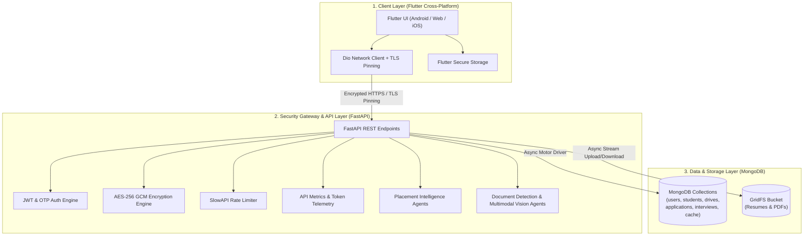

# TalentLOQ — Campus Placement & Recruitment Tracking Platform

> **Connecting Students to Opportunity** | A Next-Generation Campus Recruitment Ecosystem for Students, Corporate Recruiters, and University Placement Cells.

---

## 1. Overview

**TalentLOQ** is an enterprise-grade, cross-platform placement tracking platform engineered to automate and digitize the end-to-end campus recruitment lifecycle. Built to replace error-prone manual spreadsheets, physical paperwork, and fragmented communication channels, TalentLOQ provides a unified digital experience connecting **Students**, **Corporate Recruiters**, and **University Placement Officers**.

### Problem Solved
Traditional university hiring processes suffer from communication delays, lack of real-time application status visibility for students, high administrative sorting overhead for recruiters, and privacy risks when handling unencrypted academic records. TalentLOQ solves these challenges by offering automated CGPA eligibility screening, an autonomous AI-powered Placement Matching Agent with real-time token telemetry, live application tracking across interview rounds, native PDF resume viewing, direct recruiter-applicant messaging, a dedicated Candidate Validation Dashboard, and bank-grade data security.

### Core Capabilities
* **Automated Eligibility Engine:** Instant CGPA cutoff and backlog qualification gate before application submission.
* **Placement Intelligence Agents:** Calibrated multi-factor fit scoring (Core Skills, Project Depth, Role Readiness, Learnability) powered by intelligent Placement Matching Agents with automated failover and heuristic resilience.
* **Real-Time Token & Latency Observability:** Terminal token banners displaying prompt, completion, and total tokens per Agent query alongside HTTP request latency metrics.
* **Candidate Validation Dashboard:** Centralized recruiter screening interface to inspect applicant profiles, review AI match metrics, and validate credentials across drives.
* **Scheduled Campus Interviews Hub:** Real-time scheduling, tracking, and outcome logging across Aptitude, Technical, and HR interview rounds.
* **Direct Candidate Messaging:** Recruiter-to-student in-app chat and selection round advancement notices.
* **Embedded Resume Vault:** Integrated native PDF viewer for uploaded student resumes.
* **Enterprise Security Suite:** AES-256 GCM field-level encryption, short-lived JWT access tokens, OTP 2FA, TLS certificate pinning, and audit trails.
* **Production-Grade Containerization:** Multi-stage Docker builds, Docker Compose orchestration, and scalable Kubernetes (`k8s/`) deployment manifests with Kustomize.

---

## 2. Key Features

### 🎓 Student Portal
* **Live Placement Drives Feed:** Browse active corporate placement drives filtered by degree eligibility and minimum CGPA criteria.
* **1-Tap Application Submission:** Apply instantly using pre-verified academic records and stored PDF resumes.
* **Real-Time Application Tracker:** Live status tracking through Aptitude, Technical, and HR interview rounds.
* **Native PDF Resume Viewer:** View and verify uploaded PDF resumes directly within the application without third-party tools.
* **Direct Recruiter Chat:** Receive immediate selection round notices, interview notes, and messages directly from recruiters.

### 🏢 Recruiter & Placement Control Center
* **Candidate Validation Dashboard:** Live applicant verification across all drives with multi-state filter chips (`All`, `Pending`, `Valid`, `Not Valid`), candidate CGPA & AI Match pills, 1-tap validation status toggles, and direct offer setup.
* **Drive Publishing Engine:** Create, draft, and publish company placement listings specifying min CGPA cutoffs, CTC packages, job roles, and PDF attachments.
* **AI Match Insights Modal:** Real-time screening cheat sheet with generated technical questions, semantic skill equivalence mapping, and project evidence mining.
* **Scheduled Campus Interviews Hub:** Dedicated schedule manager organizing upcoming candidate sessions with interview type, date/time, and status tracking.
* **Applicant Evaluation Dashboard:** Grade candidate progress across selection rounds (Pass / Fail / Pending) with custom interview feedback notes.
* **Offer Setup & Dispatch:** Set up custom compensation, joining dates, and formal offer letters dispatched directly to student dashboards.

### 🤖 Multi-Agent Placement & Observability
* **Multi-Agent Placement Architecture:** Resilient, multi-tiered AI Agents orchestrating candidate screening, skill verification, and rubric evaluation, backed by deterministic heuristic scoring and Mongo TTL caching.
* **Live Terminal Token Telemetry:** Prominent terminal banners printed on every Agent inference displaying exact prompt tokens, completion tokens, and total tokens consumed.
* **API Metrics Profiler:** Built-in middleware logging method, endpoint path, HTTP status, and millisecond latency for all REST calls.

### 🔒 Security, Compliance & System Resilience
* **AES-256 GCM Field Encryption:** Encrypts sensitive academic data (CGPA, backlogs, contact info) at rest in MongoDB.
* **Multi-Factor Authentication (OTP 2FA):** Email-based OTP verification for sensitive login attempts and password resets.
* **Device Fingerprinting:** Captures unique `X-Device-ID` headers to detect and block untrusted device logins.
* **Rate Limiting & Threat Prevention:** `slowapi` rate-limiting middleware to guard authentication endpoints against brute-force attacks.
* **Windows Hot-Reload Resilience:** Automated `WindowsProactorEventLoopPolicy` configuration and `_BaseSelectorEventLoop` teardown safeguards preventing asyncio `_ssock` crashes during developer hot-reload on Windows with Python 3.12.
* **Theme-Aware Branding:** Automatic light and dark theme UI switching across native splash screens, launcher icons, and app headers.

---

## 3. Tech Stack

| Category | Technology | Usage Details |
| :--- | :--- | :--- |
| **Frontend Framework** | **Flutter (Dart `^3.12.2`)** | Cross-platform mobile & web client app |
| **UI Design System** | **Material 3 / Custom Design System** | Dynamic Light & Dark mode, curated AppColors design system |
| **Networking & Pinning** | **Dio (`^5.4.1`)** | HTTP client with TLS Certificate Pinning (`CertPinningConfig`) |
| **Local Secure Storage** | **`flutter_secure_storage`** | Encrypted JWT token and device ID storage |
| **Backend Framework** | **Python 3.10+ / FastAPI** | Asynchronous REST API server (`app/main.py`) |
| **AI Placement Intelligence** | **Multi-Agent AI Engine** | Cascading intelligent agents with real-time token tracking |
| **Data Validation** | **Pydantic v2** | Request/response schema validation (`app/models.py`) |
| **Database Engine** | **MongoDB (Async Motor Driver)** | NoSQL document database (`app/database.py`) |
| **File Storage** | **MongoDB GridFS** | Binary PDF resume & document bucket storage |
| **Security & Auth** | **PyJWT / Passlib (Bcrypt)** | JWT bearer tokens & hashed password validation |
| **Rate Limiting** | **SlowAPI** | Endpoint rate limiting (`get_remote_address`) |
| **Document Processing** | **PyPDF2 / Multimodal Vision Agents** | Document classification & multimodal OCR agent pipeline |
| **Containerization** | **Docker & Docker Compose** | Multi-stage production container images |
| **Orchestration** | **Kubernetes (K8s)** | Enterprise manifests with Kustomize, PVC, and Ingress |
| **Testing** | **Pytest (170 tests passing)** | Complete backend unit, integration, and security test suite |

---

## 4. System Architecture

TalentLOQ utilizes a decoupled **3-Tier Architecture** ensuring clear separation of concerns, high throughput, and data isolation.



---

## 5. Project Structure

```text
TalentLOQ/
├── assets/
│   └── logo/                      # Extracted branding assets (splash, launcher icon, headers)
├── backend/
│   ├── app/
│   │   ├── document_detection/    # Resume classification & multimodal OCR engine
│   │   │   ├── classifier.py      # Structural document classification logic
│   │   │   ├── extractor.py       # PDF text & key-value parsing engine
│   │   │   ├── gemini_extractor.py# Multimodal OCR agent with token observability
│   │   │   └── schemas.py         # Document classification data models
│   │   ├── routers/               # FastAPI route controllers
│   │   │   ├── auth.py            # Authentication, OTP, profile, & notification endpoints
│   │   │   ├── drives_recruiter.py# Recruiter drive publishing & applicant grading endpoints
│   │   │   ├── drives_student.py  # Student drive browsing & application endpoints
│   │   │   └── recruiter.py       # Candidate validation, applicant queries, & company endpoints
│   │   ├── services/              # AI & business logic services
│   │   │   ├── groq_matcher.py    # AI Placement Match Agent with token telemetry
│   │   │   └── llm_service.py     # Multi-Agent inference & failover orchestration
│   │   ├── config.py              # Application settings & environment configuration
│   │   ├── database.py            # MongoDB Motor client & GridFS initialization
│   │   ├── dependencies.py        # Authentication & Role-Based Access Control (RBAC)
│   │   ├── encryption.py          # AES-256 GCM field encryption implementation
│   │   ├── jwt_utils.py           # Short-lived access & refresh token utilities
│   │   ├── main.py                # FastAPI entry point, Windows event loop safeguard, & middlewares
│   │   ├── middleware.py          # SecurityHeadersMiddleware & ApiMetricsLoggingMiddleware
│   │   ├── models.py              # Pydantic data schemas & response models
│   │   ├── notifications.py       # Notification & direct messaging dispatch engine
│   │   └── security.py            # Password hashing & security utilities
│   ├── tests/                     # Automated Pytest suite (170 tests passing)
│   ├── Dockerfile                 # Multi-stage production backend container image
│   └── requirements.txt           # Python backend dependencies
├── k8s/                           # Production Kubernetes orchestration manifests
│   ├── kustomization.yaml         # Kustomize root manifest
│   ├── namespace.yaml             # Dedicated talentloq namespace
│   ├── configmap.yaml             # Environment configuration map
│   ├── secret.yaml                # Encrypted secrets definition
│   ├── mongodb.yaml               # MongoDB StatefulSet with PersistentVolumeClaim
│   ├── backend.yaml               # FastAPI Backend Deployment & Service
│   ├── frontend.yaml              # Flutter Web Nginx Deployment & Service
│   └── ingress.yaml               # Ingress routing configuration
├── lib/
│   ├── controllers/               # UI Paging & state controllers
│   ├── models/                    # Dart data models (Job, Candidate, Application, etc.)
│   ├── navigation/                # Main Navigation Wrapper & Role-Based Router
│   ├── network/                   # Dio ApiClient & TLS Cert Pinning configuration
│   ├── screens/                   # UI Screens (Auth, Recruiter, Student, Dashboard, Validation)
│   │   ├── recruiter/
│   │   │   ├── company_portal_screen.dart    # Drives, Validation Dashboard, & Interviews tabs
│   │   │   ├── candidate_detail_screen.dart  # Deep profile, skills, & AI match overview
│   │   │   └── round_result_screen.dart      # Interview grading & round advancement
│   │   └── ...
│   ├── services/                  # Business logic services (RecruiterService, AuthService, etc.)
│   ├── theme/                     # AppColors & AppTheme Material 3 styles
│   └── main.dart                  # Flutter application entry point
├── docker-compose.yml             # Local multi-container stack orchestration
├── Dockerfile                     # Multi-stage Flutter Web production container image
├── pubspec.yaml                   # Flutter dependencies & asset declarations
└── README.md                      # Project documentation
```

---

## 6. Placement Intelligence Agents & Real-Time Token Telemetry

TalentLOQ incorporates an **Enterprise Placement Intelligence Agent** ([`backend/app/services/groq_matcher.py`](file:///c:/Flutter/TalentLOQ/backend/app/services/groq_matcher.py)):

### 1. Multi-Dimensional Rubric Calibration
Candidate suitability is evaluated across four role-adaptive rubric dimensions:
* **Core Technical Skills (30–50%):** Evaluates depth and alignment of primary technical competencies.
* **Project Evidence & Depth (20–40%):** Scans portfolio for real-world complexity, production frameworks, and architecture.
* **Role Readiness (10–25%):** Assesses graduation readiness, tools familiarity (Git, Docker, CI/CD), and industry best practices.
* **Learnability & Skill Gap (10–20%):** Determines adjacency of existing skills to missing job requirements.

### 2. Live Terminal Token Observability
Every Agent inference automatically captures and prints a formatted terminal banner:

```text
+=================== [AGENT TOKEN TELEMETRY] ===================+
  Agent:             Placement Matching Agent
  Task:              Candidate-Drive Rubric Analysis
  Prompt Tokens:     788
  Completion Tokens: 1,460
  Total Tokens Used: 2,248
+==============================================================+
```

### 3. HTTP Request Latency Logging
FastAPI's [`ApiMetricsLoggingMiddleware`](file:///c:/Flutter/TalentLOQ/backend/app/middleware.py) records latency and HTTP status in real time:

```text
⚡ [API CALL] GET    /health                             -> 200 (1.1ms)
⚡ [API CALL] GET    /recruiter/validation/applicants    -> 200 (18.4ms)
⚡ [API CALL] POST   /recruiter/ai-match                 -> 200 (1120.5ms)
```

---

## 7. Installation & Setup

### 1. Clone Repository
```bash
git clone https://github.com/yash0622/TalentLOQ.git
cd TalentLOQ
```

### 2. Backend Setup
```bash
cd backend
python -m venv venv

# Windows (PowerShell):
.\venv\Scripts\Activate.ps1
# Linux/macOS:
source venv/bin/activate

pip install -r requirements.txt
```

### 3. Frontend Setup
```bash
cd ..
flutter pub get
```

---

## 8. Environment Configuration

Create a `.env` file inside `backend/` based on the following template:

```env
# Application Mode & Host
APP_ENV=development
PORT=8000

# MongoDB Configuration
MONGODB_URL=mongodb://localhost:27017
DATABASE_NAME=talentloq_db

# Security & Encryption Keys
JWT_SECRET_KEY=your_secure_jwt_secret_key_here
JWT_ALGORITHM=HS256
ACCESS_TOKEN_EXPIRE_MINUTES=30
REFRESH_TOKEN_EXPIRE_DAYS=7
ENCRYPTION_KEY=your_32_byte_base64_aes_encryption_key_here

# AI Placement Agent Configuration
AI_AGENT_ENABLED=true

# CORS Configuration
ALLOWED_ORIGINS=http://localhost:3000,http://localhost:8000,http://127.0.0.1:8000
```

---

## 9. Running the Application

### Start Backend API Server
```bash
cd backend
uvicorn app.main:app --reload --host 0.0.0.0 --port 8000
```
* **Interactive Swagger UI:** [http://localhost:8000/docs](http://localhost:8000/docs)
* **Alternative ReDoc:** [http://localhost:8000/redoc](http://localhost:8000/redoc)

### Start Flutter Client
```bash
flutter run
```

---

## 10. API Endpoints Reference

| Method | Endpoint | Description | Auth Required |
| :--- | :--- | :--- | :--- |
| `POST` | `/auth/register` | Register student or recruiter account | None |
| `POST` | `/auth/login` | Authenticate user and receive access/refresh tokens | None |
| `POST` | `/auth/otp/send` | Request email OTP for 2FA verification | None |
| `POST` | `/auth/otp/verify` | Verify email OTP code | None |
| `GET` | `/auth/notifications` | Fetch user alerts and selection notices | Bearer Token |
| `POST` | `/auth/resume/upload` | Upload candidate PDF resume to GridFS | Bearer Token |
| `GET` | `/recruiter/drives` | List published placement drives | Optional Bearer |
| `POST` | `/recruiter/drives` | Create a new company placement drive | Recruiter Bearer |
| `GET` | `/recruiter/validation/applicants` | Fetch applicants across drives for validation | Recruiter Bearer |
| `POST` | `/recruiter/applications/{id}/validate` | Update candidate validation status (`valid`/`not_valid`) | Recruiter Bearer |
| `POST` | `/recruiter/ai-match` | Generate calibrated AI Match Report & cheat sheet | Recruiter Bearer |
| `POST` | `/recruiter/drives/{drive_id}/applicants/{student_id}/round` | Grade candidate round and dispatch direct alert | Recruiter Bearer |
| `GET` | `/recruiter/interviews` | List scheduled campus interviews | Recruiter Bearer |

---

## 11. Automated Testing Suite

TalentLOQ maintains a comprehensive automated testing suite with **170 passing tests**:

```bash
cd backend
python -m pytest tests/
```

```text
============================= test session starts =============================
collected 170 items

tests\test_advanced_parsers.py .....                                     [  2%]
tests\test_application_visibility.py .....                               [  5%]
tests\test_auth.py .......                                               [ 10%]
tests\test_auth_flow.py ........                                         [ 14%]
tests\test_companies.py ..                                               [ 15%]
tests\test_document_detection.py ..............                          [ 24%]
tests\test_document_verification.py ...............                      [ 32%]
tests\test_drives.py .                                                   [ 33%]
tests\test_eligibility.py ....                                           [ 35%]
tests\test_email_draft.py ..                                             [ 37%]
tests\test_groq_matcher.py .....                                         [ 40%]
tests\test_marks_table_extractor.py .....                                [ 42%]
tests\test_notifications.py ...                                          [ 44%]
tests\test_parser_robustness.py ........................................ [ 68%]
tests\test_part3_security.py .......                                     [ 80%]
tests\test_part5_security_checklist.py ......                            [ 84%]
tests\test_part6_security_hardening.py .....                             [ 87%]
tests\test_recruiter.py ....                                             [ 89%]
tests\test_resume_internship_extraction.py .                             [ 90%]
tests\test_security_audit_fixes.py ..........                            [ 95%]
tests\test_skill_matching.py ....                                        [ 98%]
tests\test_talent_comparator.py ...                                      [100%]

====================== 170 passed, 3 warnings in 15.98s =======================
```

---

## 12. Deployment & Containerization

### 🐳 Docker Compose Deployment
```bash
docker-compose up -d --build
```
* **Web App Frontend:** [http://localhost](http://localhost)
* **FastAPI Backend:** [http://localhost:8000](http://localhost:8000)
* **MongoDB Database:** `localhost:27017`

### ☸️ Kubernetes (K8s) Cluster Deployment
```bash
kubectl apply -k k8s/
```
Verify cluster health:
```bash
kubectl get pods,svc,ingress -n talentloq
```

---

## 13. License & Acknowledgements

* **Flutter Framework** for cross-platform UI development.
* **FastAPI** for high-performance Python backend routing.
* **MongoDB & Motor** for async NoSQL document and GridFS storage.
* **Intelligent AI Agents** for automated candidate-role alignment and multimodal document parsing.
